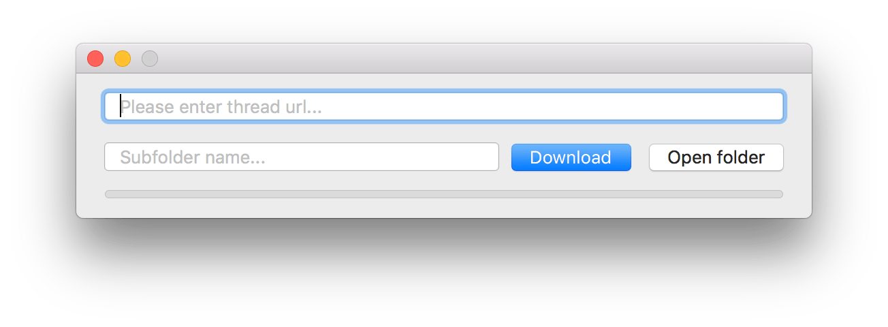
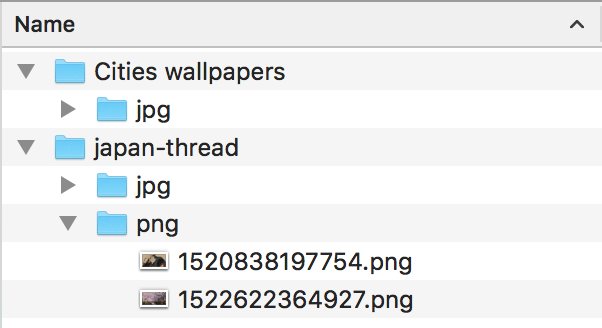

# n4t-macos

4chan media scraper written in swift.

- Paste a thread url
- Optionally enter a subfolder name
- Watch it go.

Your files will be saved under `~/Documents/n4t/{thread}`, and your files will be sorted by kind.

## Screenshots

## Shortcuts

- `cmd+enter`: download
- `cmd+n`: spawn new instance of n4t